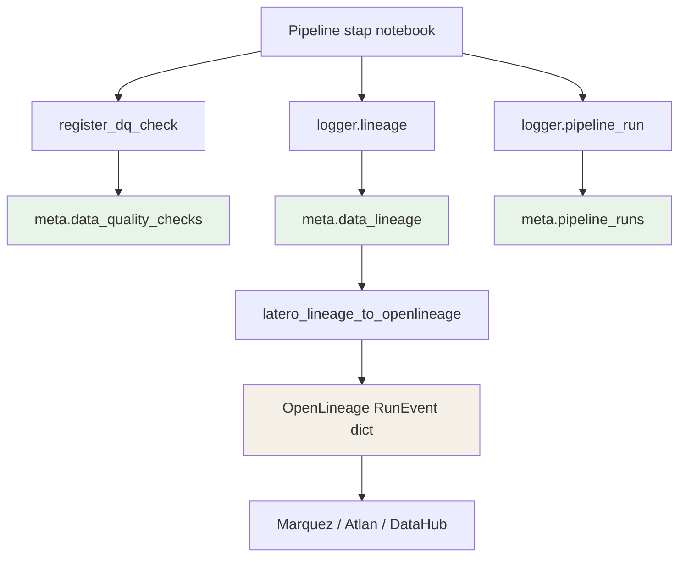

# Latero — Architectuur

## Wat is Latero en wat lost het op

Een datapipeline levert twee dingen: data en de kennis over hoe die data tot stand is gekomen. Het eerste wordt zorgvuldig bewaard. Het tweede verdwijnt systematisch — in log-statements zonder schema, in notebooks die niemand archiveert, in mondelinge afspraken over wat een check al dan niet afdwingt.

Latero lost dit op door metadata-registratie onderdeel te maken van elke pipeline-uitvoering. Niet als naderhand toe te voegen laag, maar als structurele eigenschap van de pipeline zelf. Elke stap produceert automatisch gestructureerd bewijs: welke notebook is uitgevoerd, welke DQ-checks zijn geëvalueerd, welke data is verplaatst en van waar naar waar. Dat bewijs is raadpleegbaar, herhaalbaar en auditeerbaar — en het is platformonafhankelijk.

---

## De drie lagen

Latero is opgebouwd als drie afzonderlijke runtime-grenzen.

**Consumer integration layer** — de buitenste grens. Hier laadt een consumer zijn eigen configuratie, dataset contracts en business metadata. Eventuele legacy-vertaling naar het Latero runtime contract vindt hier plaats. Deze laag is consumer-eigendom en heeft geen rol in de normatieve Latero productdefinitie.

**Latero kern** (`latero/framework.py`) — de tweede grens. Een platformonafhankelijk Python-pakket dat uitsluitend standaard bibliotheekmodules importeert. Bevat de policy engine, de abstracte `EventLogger` interface en herbruikbare control events. De kern weet niets van Delta, Spark, Snowflake of welke andere platformspecifieke technologie dan ook.

**Platform adapters** (`latero/adapters/`) — de derde grens. Concrete implementaties van de `EventLogger` interface die metadata wegschrijven naar een specifieke opslaglaag. Elke adapter is een op zichzelf staand sub-pakket met eigen bootstrap SQL.

```
Consumer repository / integration layer
  - business config, dataset contracts, optionele config bridge
         │
         │  gevalideerd Latero runtime contract
         ▼
latero.framework                        (alleen Python stdlib)
  - register_dq_check()   — policy engine
  - EventLogger (ABC)     — adapter interface
  - build_runtime_config / validate_runtime_config / resolve_effective_policy
  - build_attribute_lineage_rows
  - finalize_dq_coverage_run / record_scope_validation
         │
         ├──────────────────────┬──────────────────────┐
         ▼                      ▼                      ▼
latero.adapters.          latero.adapters.       (toekomstige
databricks                 snowflake                adapters)
  DeltaEventLogger           SnowflakeEventLogger
  Unity Catalog Delta        Snowflake connector
         │
         ▼
latero.lineage.openlineage              (alleen Python stdlib)
  build_run_event()
  build_column_lineage_facet()
  latero_lineage_to_openlineage()
```

---

## Meta-tabellen

Elke adapter schrijft naar drie meta-tabellen. De tabelschema's zijn gedefinieerd in schema-versie `1.1` en worden aangemaakt via het adapter-specifieke bootstrap SQL-script.

### `meta.pipeline_runs`

Één rij per pipeline-stap uitvoering.

| Kolom | Type | Beschrijving |
|-------|------|-------------|
| `run_id` | STRING | Unieke run-identifier voor deze stap |
| `dataset_id` | STRING | Dataset die deze stap verwerkt |
| `step` | STRING | Stap-naam (bijv. `raw_to_bronze`) |
| `run_status` | STRING | `SUCCESS`, `WARNING`, `FAILED` |
| `started_at` | TIMESTAMP | Starttijdstip van de run |
| `ended_at` | TIMESTAMP | Eindtijdstip van de run |
| `duration_ms` | BIGINT | Looptijd in milliseconden |
| `input_refs` | MAP | Verwijzingen naar bronentiteiten en DQ-samenvatting |
| `output_refs` | MAP | Verwijzingen naar doelentiteiten en rij-aantallen |
| `run_metrics` | MAP | Aanvullende kwantitatieve run-statistieken |
| `errors` | ARRAY | Foutberichten als de run mislukt is |
| `parent_run_id` | STRING | Job-niveau run-ID die stap-runs groepeert |
| `source_system` | STRING | Productneutrale identifier van het bronsysteem |
| `environment` | STRING | Omgevingstag (`dev`, `acc`, `prd`) |
| `schema_version` | STRING | Meta-tabelschemaversie, altijd `"1.1"` |

### `meta.data_quality_checks`

Één rij per geregistreerde DQ-check per run.

| Kolom | Type | Beschrijving |
|-------|------|-------------|
| `run_id` | STRING | Verwijzing naar de bijbehorende pipeline run |
| `check_id` | STRING | Check-identifier, uniek per stap |
| `check_status` | STRING | `PASS`, `FAIL`, `WARN`, `ERROR`, `SKIPPED` |
| `check_result` | MAP | Details van de check-uitvoering |
| `check_category` | STRING | Categorie (zie categorietabel hieronder) |
| `policy_version` | STRING | Versie van het check-beleid dat gold bij uitvoering |
| `timestamp_utc` | TIMESTAMP | Tijdstip waarop de check is geregistreerd |
| `source_system` | STRING | Overgenomen van de logger-configuratie |
| `schema_version` | STRING | `"1.1"` |

**Toegestane waarden voor `check_category`:**

| Categorie | Wat het dekt |
|-----------|-------------|
| `completeness` | Aanwezigheid van vereiste velden en rijen |
| `uniqueness` | Duplicaatdetectie op kolom- of sleutelniveau |
| `validity` | Waardebereiken, reguliere expressies, toegestane waarden |
| `volume` | Rij-aantallen en delta-drempels |
| `schema` | Kolomaanwezigheid en type-conformiteit |
| `statistical` | Statistische afwijkingen en null-rates |
| `referential` | Referentiële integriteit en mapping-volledigheid |
| `freshness` | Tijdigheid van brondata |
| `timeliness` | SLA-conformiteit van pipeline-uitvoering |

### `meta.data_lineage`

Één rij per source-naar-doel-overgang op attribuutniveau.

| Kolom | Type | Beschrijving |
|-------|------|-------------|
| `run_id` | STRING | Verwijzing naar de bijbehorende pipeline run |
| `source_type` | STRING | Type bronentiteit (bijv. `delta_table`, `volume_file`) |
| `source_ref` | STRING | Volledig gekwalificeerde verwijzing naar de bron |
| `source_entity` | STRING | Entiteitnaam van de bron |
| `source_attribute` | STRING | Kolom- of attribuutnaam van de bron |
| `target_type` | STRING | Type doelentiteit |
| `target_ref` | STRING | Volledig gekwalificeerde verwijzing naar het doel |
| `target_entity` | STRING | Entiteitnaam van het doel |
| `target_attribute` | STRING | Kolom- of attribuutnaam van het doel |
| `lineage_evidence` | MAP | Aanvullende transformatie-informatie |
| `timestamp_utc` | TIMESTAMP | Tijdstip van de lineage-registratie |
| `schema_version` | STRING | `"1.1"` |

---

## Policy engine

### Initialisatievolgorde

Latero hanteert één officiële initialisatievolgorde. Elke consumer-integratie volgt deze vier stappen:

1. **`build_runtime_config(...)`** — laad consumer-config en bouw het product-shaped Latero runtime contract. Legacy-vertaling hoort hier, in de consumer integration layer.
2. **`validate_runtime_config(...)`** — valideer het contract op vereiste velden (`config_schema_version`, `installation_id`, `adapter_profiles`, `effective_policy`, `runtime_steps`).
3. **`resolve_effective_policy(...)`** — materialiseer één deterministische effective policy set uit bundles en overlays.
4. **`create_event_logger(...)`** — los het adapter-profiel op en instantieer de platform-logger.

Geen enkele aanroep van `register_dq_check` of adapter-bootstrap mag plaatsvinden vóór stap 2 is geslaagd.

### Check status domain

`CheckStatus` definieert vijf eerste-klas waarden:

| Status | Betekenis |
|--------|----------|
| `PASS` | Check uitgevoerd; resultaat positief |
| `FAIL` | Check uitgevoerd; resultaat negatief |
| `WARN` | Check uitgevoerd; negatief resultaat in observe-modus met high severity |
| `ERROR` | Check kon niet worden uitgevoerd vanwege een onverwerkte uitzondering |
| `SKIPPED` | Check was aangemeld maar is niet uitgevoerd |

### CheckMode gedragmatrix

| mode | severity | check-resultaat | check_status | gedrag |
|------|----------|-----------------|--------------|--------|
| `enforce` | elke | FAIL | `FAIL` | Schrijf record; gooi `RuntimeError` |
| `observe` | `high` | FAIL | `FAIL` | Schrijf record; log op ERROR-niveau |
| `observe` | `medium` of `low` | FAIL | `FAIL` | Schrijf record; log op WARNING-niveau |
| elke | elke | PASS | `PASS` | Schrijf record; log op DEBUG-niveau |
| elke | elke | uitzondering | `ERROR` | Schrijf record; gooi de originele uitzondering |
| elke | elke | overgeslagen | `SKIPPED` | Schrijf record; geen fout |

`mode: enforce` stopt altijd bij FAIL, ongeacht severity. Een downgrade van `enforce` naar `observe` verzwakt compliancegaranties en vereist expliciete rechtvaardiging.

---

## Adapter model

### Databricks adapter (`latero/adapters/databricks/`)

De Databricks adapter implementeert `EventLogger` via `DeltaEventLogger`. Schrijft naar drie Unity Catalog Delta-tabellen via `append_rows(spark, table, rows)`, een schema-gedreven Delta writer die Python-dicts op het exacte doeltabelschema mapt. Velden die niet in het schema staan worden stilzwijgend gedropt.

Naast de platformonafhankelijke velden legt de adapter Databricks-specifieke context vast via `resolve_databricks_run_context(dbutils)`: job-ID, job-run-ID en taakrun-context voor orchestratiehiërarchie.

### Snowflake adapter (`latero/adapters/snowflake/`)

Implementeert dezelfde `EventLogger` interface via de Snowflake Python connector. Schrijft naar drie Snowflake-tabellen. Legt Snowflake-specifieke context vast zoals query-ID en warehouse. De kern, de check policy en de herbruikbare control events blijven volledig ongewijzigd.

---

## OpenLineage compatibiliteit

Latero v1.0.0 introduceert `latero.lineage.openlineage`: een puur-Python module zonder externe afhankelijkheden die Latero lineage events omzet naar OpenLineage RunEvent-structuren conform spec v1.0.5.

De module is builder-only. Latero stuurt geen events via HTTP naar een externe backend. Dat is de verantwoordelijkheid van de consumer, zodat teams die geen OpenLineage-backend hebben, geen onnodige afhankelijkheden meesleuren.

### Verhouding `data_lineage` → OpenLineage

Elke rij in `meta.data_lineage` beschrijft één attribuut-overgang: één bronkolom naar één doelkolom, per pipeline-run. `latero_lineage_to_openlineage()` groepeert meerdere rijen per bron- en doeldataset en bouwt:

- één **input Dataset** per unieke `source_ref`
- één **output Dataset** per unieke `target_ref`
- een **ColumnLineageDatasetFacet** per output met alle attribuut-overgangen als `inputFields`

Het resultaat is een volledig geldig OpenLineage RunEvent dict dat direct te POST-en is naar Marquez, Atlan of DataHub.

### Diagram: data flow



---

## Wat behoort niet tot Latero

- Dataset-semantiek (wat is cbsenergie, wat zijn energielabels)
- Repository-layout (waar staan notebooks, dbt-modellen, contracts)
- Transformatielogica (deduplicatie, type-casting, businessregels)
- Deployment en infrastructuurprovisioning
- Workspace-niveau toegangsbeheer
- Automatische schema-migratie van meta-tabellen

---

## Zie ook

- [Configuratiemodel](configuratie-model.md) — de canonieke product-configuratiegrens
- [Vereisten](vereisten.md) — normatieve requirements
- [Positionering](positionering.md) — doelgroep en marktpositie
- [Aan de slag](../implementatie/aan-de-slag.md) — integratie-instructies
- [OpenLineage how-to](../implementatie/lineage-openlineage.md) — OpenLineage builders gebruiken

